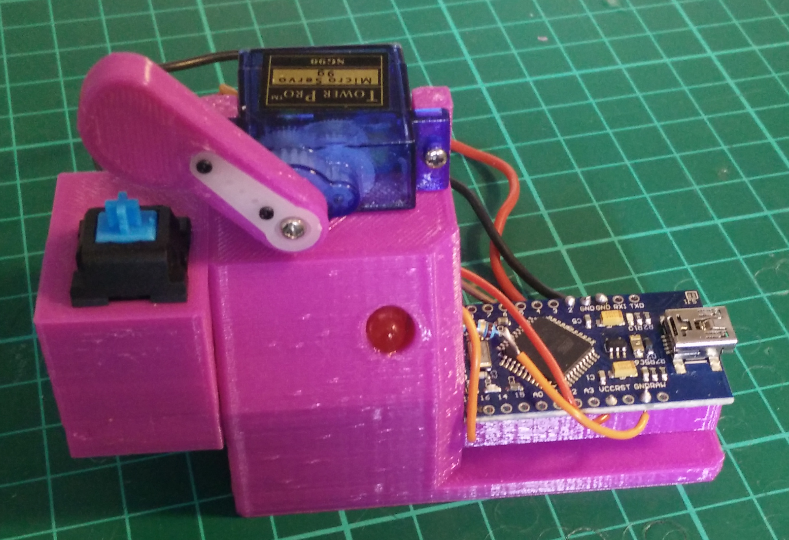

# Automatic keyboard switch tester

This is the code and CAD for the automatic keyboard switch tester.

You can learn more in my blog post at https://incoherency.co.uk/blog/stories/keyswitch-tester.html

It is not spectacularly well designed, so if you want to make one you might instead consider designing an improved version.

You can [watch a video of it in action](https://www.youtube.com/watch?v=jl0PIKjTmjM).

## Assembly instructions

Print 1 each of servohorn.stl, keyswitch-tester.stl, and a holder for whatever type of switch you're using (e.g. cherry-holder.stl).

You'll also need:

 - 1x micro servo (Tower Pro SG90 or compatible)
 - 1x Arduino (I suggest Nano, Pro Micro, or similar)
 - Some short lengths of wire

Optional:

 - 5x M3 threaded insert
 - 1x LED
 - 1x resistor for the LED (e.g. 470 Ohm)

Fit the threaded inserts to the main body by holding them with tweezers while pressing down gently with a hot soldering iron. If you don't
want to use threaded inserts you can just use slightly larger screws and thread directly into the plastic. The hole is about 4mm across.

Super-glue the Arduino to the lower deck, and the LED into the hole. Screw the servo to the mounts on the upper deck. Screw the servo
arm extension on to the servo horn, and fit it to the servo.

Solder the black/brown wire from the servo to one of the GND pins, the red wire to the VCC pin, and the yellow/orange wire
to pin 9.

Solder the resistor to the negative lead of the LED, and a wire from the resistor to another GND pin. Solder the positive lead
of the LED to pin 10. If you don't want to use an LED, the device will still work, you just won't get visual feedback of when
the switch has been pressed.

Solder a loose wire to another GND pin, and another loose wire to pin 2. Solder the other end of the loose wires to whatever
switch you're trying to test.

Fit your switch to your holder, and screw it to the end plate of the tester.

## Usage instructions

Plug in the Arduino and upload the code. If the servo is stalling, or is not moving through the correct range of motion, then you can
either remove and re-fit the servo arm at a different angle, or adjust the "servomin" and "servomax" parameters in the code.

Once it's clicking your switch properly (which you can verify by looking at the LED you fitted), then you can connect your logging
program to the USB serial port to collect data.

## Contributing

Please contribute any and all changes or fixes. If your contribution does not conveniently fit with the rest of the project, I'll stick
it in a `contrib/` directory so that other people can still get it.

I'm particularly interested in holders for different types of switch, and an improved design for the main body of the tester that meets either
or both of the following:

1. use less plastic (print faster)

2. allow the servo arm to reach its full range of motion instead of crashing into the deck

## Contact

You can email me at james@incoherency.co.uk, or read my blog at https://incoherency.co.uk/
